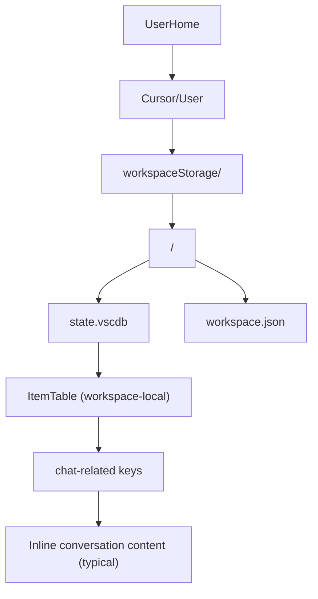
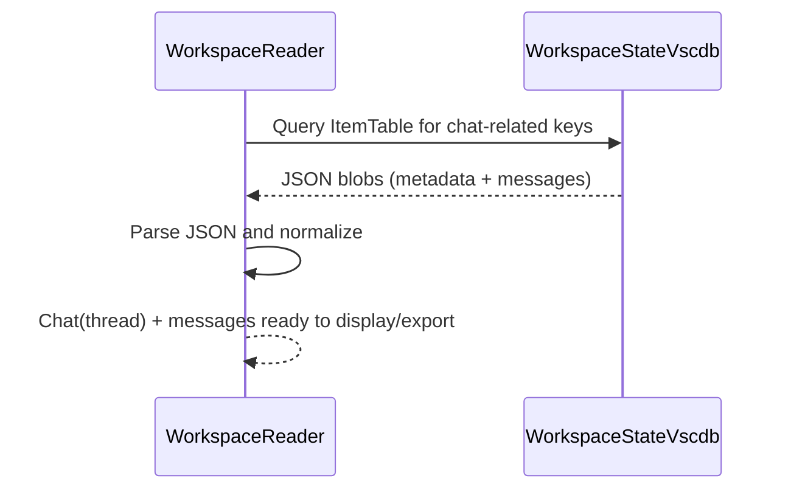
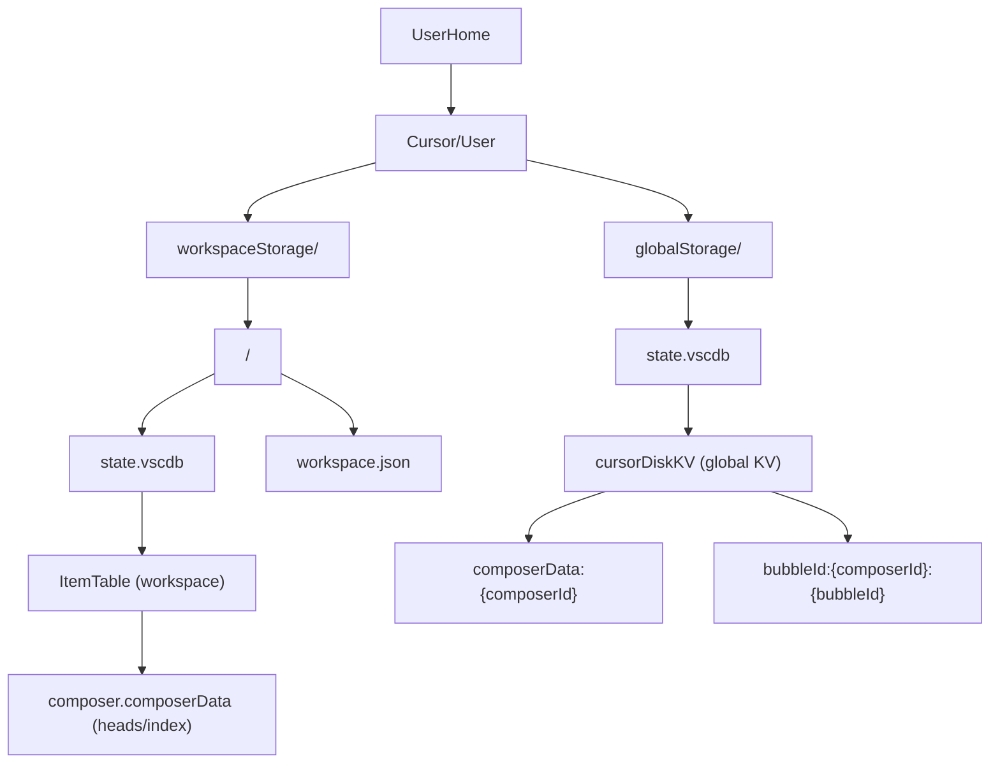
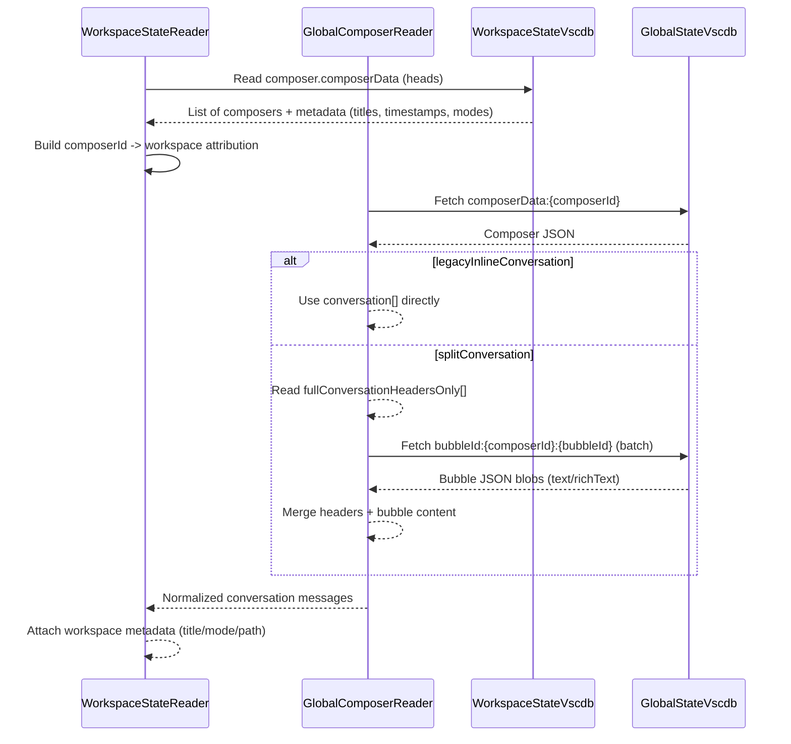

## Cursor Chat Storage Architecture Diagrams (Old vs Modern)

This document provides **two architectures** (Old vs Modern) and **three diagram types for each**:

- **Diagram Type A**: Storage layout (filesystem + DBs)
- **Diagram Type B**: Dataflow (how a chat is reconstructed)
- **Diagram Type C**: Key-space / entities (what lives where)

Notes:

- “Old” here refers to the earlier pattern where **workspace-local `state.vscdb`** generally contained enough information to reconstruct conversations without a global join.
- “Modern” refers to Cursor’s split model where **workspace DBs contain metadata/indices** and **global DB contains the content**, sometimes in **headers + per-bubble blobs**.

---

## Old Architecture

### Diagram A (Old): Storage Layout



### Diagram B (Old): Dataflow (Reconstruct Chat)



### Diagram C (Old): Entities / Key-Space View

```mermaid
flowchart LR
  subgraph workspaceDB_Old [Workspace state.vscdb (Old)]
    itemTableOld["ItemTable"]
    itemTableOld --> chatMetaOld["chat metadata keys"]
    itemTableOld --> chatMsgsOld["conversation/messages (inline JSON)"]
    itemTableOld --> uiStateOld["other UI state"]
  end

  chatMetaOld --> chatMsgsOld
```

---

## Modern Architecture

### Diagram A (Modern): Storage Layout (Workspace + Global)



### Diagram B (Modern): Dataflow (Reconstruct Chat with Bubble Split)



### Diagram C (Modern): Entities / Key-Space View

```mermaid
flowchart LR
  subgraph workspaceDB_Modern [Workspace state.vscdb (Modern)]
    itemTableModern["ItemTable"]
    itemTableModern --> composerHeadsModern["composer.composerData (heads)"]
    composerHeadsModern --> composerIdRefs["composerId references"]
  end

  subgraph globalDB_Modern [Global state.vscdb (Modern)]
    cursorDiskKVModern["cursorDiskKV"]
    cursorDiskKVModern --> composerDataModern["composerData:{composerId}"]
    composerDataModern --> conversationInlineModern["conversation[] (sometimes)"]
    composerDataModern --> headersOnlyModern["fullConversationHeadersOnly[] (sometimes)"]
    cursorDiskKVModern --> bubbleDataModern["bubbleId:{composerId}:{bubbleId}"]
  end

  composerIdRefs --> composerDataModern
  headersOnlyModern --> bubbleDataModern
```

---

## Appendix: Quick “Old vs Modern” Mental Model (ASCII)

<!-- 0----+----1----+----2----+----3----+----4----+----5----+----6----+----7----+ -->
<!-- Box width target: 74 characters between pipes -->

### Old (Workspace-centric)

┌──────────────────────────────────────────────────────────────────────────┐
│ workspaceStorage/<hash>/state.vscdb │
│ └─ ItemTable: chat keys → JSON blobs (metadata + inline messages) │
│ │
│ Reconstruct chat: read workspace DB → parse JSON → done │
└──────────────────────────────────────────────────────────────────────────┘

### Modern (Split: workspace metadata + global content)

┌──────────────────────────────────────────────────────────────────────────┐
│ workspaceStorage/<hash>/state.vscdb │
│ └─ ItemTable: composer.composerData → composerId “heads” + metadata │
│ │
│ globalStorage/state.vscdb │
│ └─ cursorDiskKV: │
│ - composerData:{composerId} → conversation OR headers-only │
│ - bubbleId:{composerId}:{bubbleId} → bubble content (split format) │
│ │
│ Reconstruct chat: workspace heads → fetch composerData → maybe fetch │
│ bubbles → merge → attach workspace attribution → done │
└──────────────────────────────────────────────────────────────────────────┘
