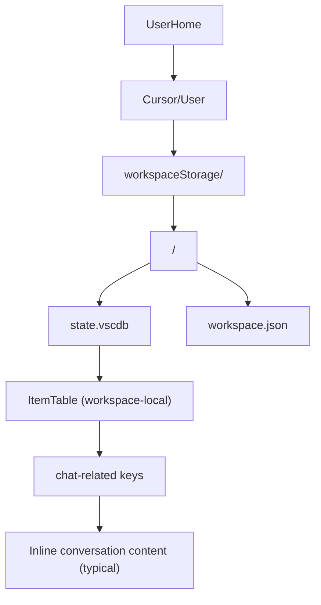
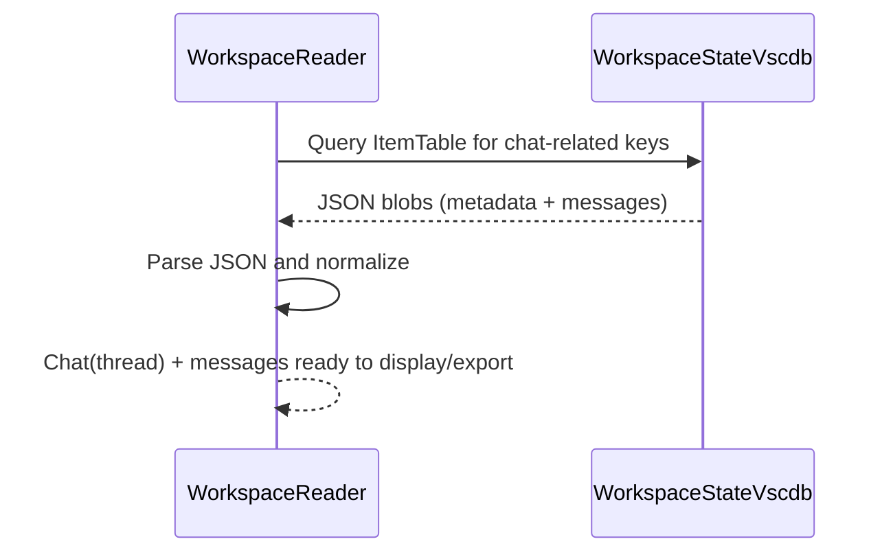
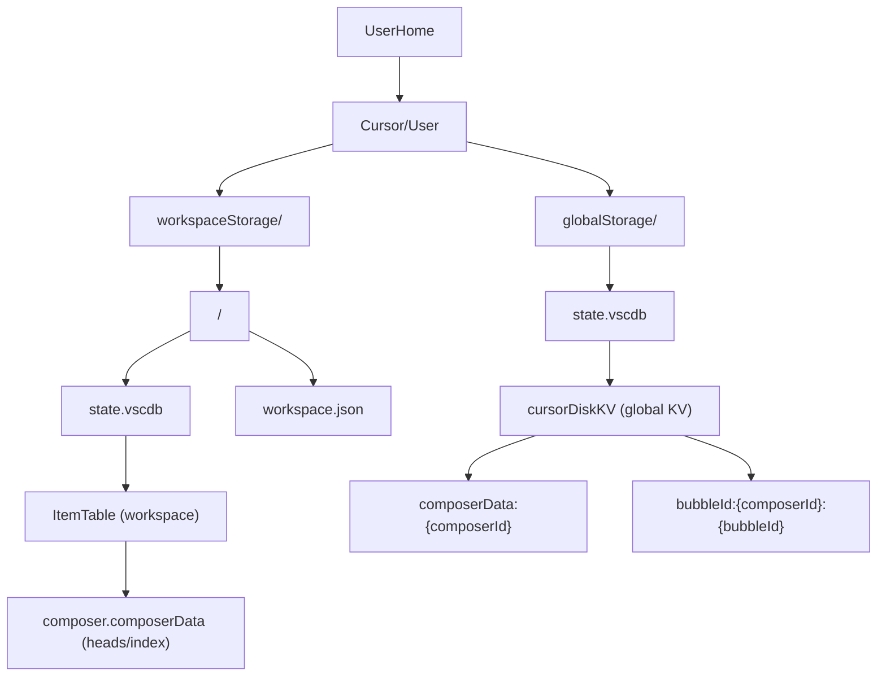
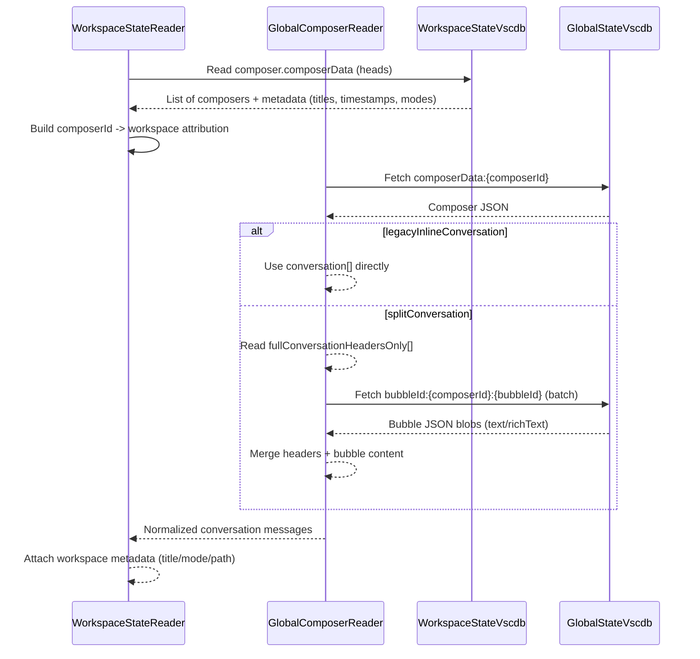

# Cursor Storage Reference

This document provides a comprehensive reference for Cursor's chat storage architecture, SQLite schema, and JSON payload formats. This is **reverse-engineered** from Cursor's internal storage and may change without notice.

**Last Updated**: 2025-12-26  
**Schema Version Observed**: `_v: 10` (composerData), `_v: 3` (bubbles)

---

## Table of Contents

1. [Architecture Overview](#architecture-overview)
2. [SQLite Tables](#sqlite-tables)
3. [composerData JSON Reference](#composerdata-json-reference)
4. [Bubble JSON Reference](#bubble-json-reference)
5. [Examples](#examples)

---

## Architecture Overview

Cursor uses two storage architectures: **Old** (workspace-centric) and **Modern** (split storage). This section explains both with diagrams.

### Old vs Modern

- **Old**: Workspace-local `state.vscdb` contained enough information to reconstruct conversations without a global join.
- **Modern**: Workspace DBs contain metadata/indices, while global DB contains the content, sometimes in headers + per-bubble blobs.

### Old Architecture

#### Diagram A (Old): Storage Layout



#### Diagram B (Old): Dataflow (Reconstruct Chat)



#### Diagram C (Old): Entities / Key-Space View

```mermaid
flowchart LR
  subgraph workspaceDB_Old [Workspace state.vscdb (Old)]
    itemTableOld["ItemTable"]
    itemTableOld --> chatMetaOld["chat metadata keys"]
    itemTableOld --> chatMsgsOld["conversation/messages (inline JSON)"]
    itemTableOld --> uiStateOld["other UI state"]
  end

  chatMetaOld --> chatMsgsOld
```

### Modern Architecture

#### Diagram A (Modern): Storage Layout (Workspace + Global)



#### Diagram B (Modern): Dataflow (Reconstruct Chat with Bubble Split)



#### Diagram C (Modern): Entities / Key-Space View

```mermaid
flowchart LR
  subgraph workspaceDB_Modern [Workspace state.vscdb (Modern)]
    itemTableModern["ItemTable"]
    itemTableModern --> composerHeadsModern["composer.composerData (heads)"]
    composerHeadsModern --> composerIdRefs["composerId references"]
  end

  subgraph globalDB_Modern [Global state.vscdb (Modern)]
    cursorDiskKVModern["cursorDiskKV"]
    cursorDiskKVModern --> composerDataModern["composerData:{composerId}"]
    composerDataModern --> conversationInlineModern["conversation[] (sometimes)"]
    composerDataModern --> headersOnlyModern["fullConversationHeadersOnly[] (sometimes)"]
    cursorDiskKVModern --> bubbleDataModern["bubbleId:{composerId}:{bubbleId}"]
  end

  composerIdRefs --> composerDataModern
  headersOnlyModern --> bubbleDataModern
```

### Quick "Old vs Modern" Mental Model (ASCII)

#### Old (Workspace-centric)

┌──────────────────────────────────────────────────────────────────────────┐
│ workspaceStorage/<hash>/state.vscdb │
│ └─ ItemTable: chat keys → JSON blobs (metadata + inline messages) │
│ │
│ Reconstruct chat: read workspace DB → parse JSON → done │
└──────────────────────────────────────────────────────────────────────────┘

#### Modern (Split: workspace metadata + global content)

┌──────────────────────────────────────────────────────────────────────────┐
│ workspaceStorage/<hash>/state.vscdb │
│ └─ ItemTable: composer.composerData → composerId "heads" + metadata │
│ │
│ globalStorage/state.vscdb │
│ └─ cursorDiskKV: │
│ - composerData:{composerId} → conversation OR headers-only │
│ - bubbleId:{composerId}:{bubbleId} → bubble content (split format) │
│ │
│ Reconstruct chat: workspace heads → fetch composerData → maybe fetch │
│ bubbles → merge → attach workspace attribution → done │
└──────────────────────────────────────────────────────────────────────────┘

---

## SQLite Tables

Cursor stores chat data in SQLite databases with simple key-value tables. This section documents the table structures.

### Database Locations

- **Global**: `globalStorage/state.vscdb`
- **Workspace**: `workspaceStorage/<hash>/state.vscdb`

**Note**: Cursor may add/remove tables across versions; this doc reflects the DBs inspected on this machine.

### Global Storage: `globalStorage/state.vscdb`

#### sqlite_master objects

| type | name | tbl_name | sql |
| --- | --- | --- | --- |
| index | `sqlite_autoindex_ItemTable_1` | `ItemTable` | `` |
| index | `sqlite_autoindex_cursorDiskKV_1` | `cursorDiskKV` | `` |
| table | `ItemTable` | `ItemTable` | `CREATE TABLE ItemTable (key TEXT UNIQUE ON CONFLICT REPLACE, value BLOB)` |
| table | `cursorDiskKV` | `cursorDiskKV` | `CREATE TABLE cursorDiskKV (key TEXT UNIQUE ON CONFLICT REPLACE, value BLOB)` |

#### Tables and columns

##### `ItemTable`

| cid | name | type | notnull | dflt_value | pk |
| --- | --- | --- | --- | --- | --- |
| 0 | `key` | `TEXT` | 0 | `None` | 0 |
| 1 | `value` | `BLOB` | 0 | `None` | 0 |

##### `cursorDiskKV`

| cid | name | type | notnull | dflt_value | pk |
| --- | --- | --- | --- | --- | --- |
| 0 | `key` | `TEXT` | 0 | `None` | 0 |
| 1 | `value` | `BLOB` | 0 | `None` | 0 |

**Foreign keys**: (none)

### Workspace Storage: `workspaceStorage/<hash>/state.vscdb`

#### sqlite_master objects

| type | name | tbl_name | sql |
| --- | --- | --- | --- |
| index | `sqlite_autoindex_ItemTable_1` | `ItemTable` | `` |
| index | `sqlite_autoindex_cursorDiskKV_1` | `cursorDiskKV` | `` |
| table | `ItemTable` | `ItemTable` | `CREATE TABLE ItemTable (key TEXT UNIQUE ON CONFLICT REPLACE, value BLOB)` |
| table | `cursorDiskKV` | `cursorDiskKV` | `CREATE TABLE cursorDiskKV (key TEXT UNIQUE ON CONFLICT REPLACE, value BLOB)` |

#### Tables and columns

##### `ItemTable`

| cid | name | type | notnull | dflt_value | pk |
| --- | --- | --- | --- | --- | --- |
| 0 | `key` | `TEXT` | 0 | `None` | 0 |
| 1 | `value` | `BLOB` | 0 | `None` | 0 |

##### `cursorDiskKV`

| cid | name | type | notnull | dflt_value | pk |
| --- | --- | --- | --- | --- | --- |
| 0 | `key` | `TEXT` | 0 | `None` | 0 |
| 1 | `value` | `BLOB` | 0 | `None` | 0 |

**Foreign keys**: (none)

---

## composerData JSON Reference

Cursor stores chat data in `globalStorage/state.vscdb` using the `cursorDiskKV` table with these key patterns:

| Key Pattern | Description |
|-------------|-------------|
| `composerData:{composerId}` | Main composer/conversation metadata |
| `bubbleId:{composerId}:{bubbleId}` | Individual message content (split storage) |

### Core Fields

| Field | Type | Description |
|-------|------|-------------|
| `_v` | `int` | Schema version (currently `10`) |
| `composerId` | `string` | UUID identifying this composer session |
| `name` | `string?` | User-provided chat title (if renamed) |
| `subtitle` | `string?` | Auto-generated subtitle from first message |
| `text` | `string` | Current input box text (what user is typing) |
| `richText` | `string` | Lexical editor JSON for input (rich formatting) |
| `createdAt` | `int` | Unix timestamp in milliseconds |
| `lastUpdatedAt` | `int?` | Last update timestamp (ms) |
| `hasLoaded` | `bool` | Whether composer has fully loaded |

### Conversation Storage

| Field | Type | Description |
|-------|------|-------------|
| `fullConversationHeadersOnly` | `BubbleHeader[]` | **Modern format**: Array of bubble headers (content stored separately) |
| `conversationMap` | `object` | **Legacy format**: Direct bubble content (usually empty in modern storage) |
| `conversation` | `Bubble[]?` | **Legacy format**: Inline conversation array (rarely used now) |

#### BubbleHeader

```json
{
  "bubbleId": "uuid",        // Local bubble identifier
  "type": 1,                 // 1 = user, 2 = assistant
  "serverBubbleId": "uuid?"  // Server-side ID (for assistant responses)
}
```

### Mode & Status

| Field | Type | Values | Description |
|-------|------|--------|-------------|
| `status` | `string` | `"none"`, `"generating"`, `"completed"`, `"error"` | Current generation status |
| `forceMode` | `string` | `"edit"`, `"chat"`, `"agent"` | User-selected mode |
| `unifiedMode` | `string` | `"agent"`, `"chat"`, etc. | Internal unified mode |
| `isAgentic` | `bool` | | Whether agent mode is active |

### Context & Attachments

| Field | Type | Description |
|-------|------|-------------|
| `context` | `Context` | All attached context (files, selections, etc.) |
| `allAttachedFileCodeChunksUris` | `string[]` | URIs of attached files |
| `contextUsagePercent` | `float?` | Percentage of context window used |

#### Context Object

```json
{
  "composers": [],              // Referenced composers
  "quotes": [],                 // Quoted text selections
  "selectedCommits": [],        // Git commits
  "selectedPullRequests": [],   // GitHub PRs
  "selectedImages": [],         // Attached images
  "folderSelections": [],       // Folders added to context
  "fileSelections": [],         // Files added to context
  "selections": [],             // Code selections
  "terminalSelections": [],     // Terminal output
  "selectedDocs": [],           // Documentation references
  "externalLinks": [],          // URLs
  "cursorRules": [],            // Cursor rules referenced
  "cursorCommands": [],         // Commands referenced
  "ideEditorsState": true,      // Whether IDE state is included
  "gitPRDiffSelections": [],    // PR diff selections
  "mentions": {                 // Mentioned items with UUIDs
    "composers": {},
    "quotes": {},
    "fileSelections": {},
    "terminalFiles": {},
    "useWeb": [],
    "useLinterErrors": [],
    "autoContext": [],
    // ... more mention types
  }
}
```

### Model Configuration

| Field | Type | Description |
|-------|------|-------------|
| `modelConfig` | `ModelConfig` | Model settings |

```json
{
  "modelName": "claude-4.5-opus-high-thinking",  // or "default", "gpt-4", etc.
  "maxMode": true                                 // Whether max/thinking mode enabled
}
```

### Capabilities

| Field | Type | Description |
|-------|------|-------------|
| `capabilities` | `Capability[]` | Enabled tool capabilities |

```json
{
  "type": 30,        // Capability type ID (internal enum)
  "data": {}         // Capability-specific configuration
}
```

**Known capability types** (partial list, reverse-engineered):
- `15` - Code blocks
- `16` - File operations
- `18` - Terminal
- `19` - Web search
- `21` - Git operations
- `22` - Unknown
- `23` - Unknown
- `24` - MCP tools
- `25` - Unknown
- `29` - Unknown
- `30` - Tool calling
- `31` - Unknown
- `32` - Unknown
- `33` - Unknown
- `34` - Unknown

### File Changes Tracking

| Field | Type | Description |
|-------|------|-------------|
| `originalFileStates` | `object` | Original file contents before edits |
| `newlyCreatedFiles` | `string[]` | Files created in this session |
| `newlyCreatedFolders` | `string[]` | Folders created in this session |
| `totalLinesAdded` | `int` | Lines added across all files |
| `totalLinesRemoved` | `int` | Lines removed across all files |
| `addedFiles` | `int` | Number of files added |
| `removedFiles` | `int` | Number of files removed |
| `filesChangedCount` | `int` | Total files changed |

### UI State

| Field | Type | Description |
|-------|------|-------------|
| `isFileListExpanded` | `bool` | File list panel state |
| `isQueueExpanded` | `bool` | Queue panel state |
| `hasUnreadMessages` | `bool` | Unread indicator |
| `browserChipManuallyDisabled` | `bool` | Web search chip state |
| `browserChipManuallyEnabled` | `bool` | Web search chip state |
| `gitHubPromptDismissed` | `bool` | GitHub integration prompt |

### Worktree / Branch State

| Field | Type | Description |
|-------|------|-------------|
| `createdOnBranch` | `string` | Git branch when created |
| `isCreatingWorktree` | `bool` | Worktree creation in progress |
| `isApplyingWorktree` | `bool` | Worktree apply in progress |
| `isUndoingWorktree` | `bool` | Worktree undo in progress |
| `applied` | `bool` | Whether changes have been applied |
| `pendingCreateWorktree` | `bool` | Pending worktree creation |

### Advanced / Internal

| Field | Type | Description |
|-------|------|-------------|
| `generatingBubbleIds` | `string[]` | Bubbles currently generating |
| `codeBlockData` | `object` | Code block edit state |
| `subComposerIds` | `string[]` | Sub-composer references |
| `capabilityContexts` | `array` | Capability-specific context |
| `todos` | `array` | TODO list items |
| `speculativeSummarizationEncryptionKey` | `string` | Encryption key for summaries |
| `latestChatGenerationUUID` | `string?` | Latest generation request ID |

### Feature Flags / Experiments

| Field | Type | Description |
|-------|------|-------------|
| `isArchived` | `bool` | Whether chat is archived |
| `isDraft` | `bool` | Draft status |
| `isBestOfNSubcomposer` | `bool` | Best-of-N sampling |
| `isBestOfNParent` | `bool` | Best-of-N parent |
| `bestOfNJudgeWinner` | `bool` | Best-of-N result |
| `isSpec` | `bool` | Spec mode |
| `isSpecSubagentDone` | `bool` | Spec subagent completion |
| `isNAL` | `bool` | Unknown flag |
| `planModeSuggestionUsed` | `bool` | Plan mode flag |

---

## Bubble JSON Reference

Stored at key: `bubbleId:{composerId}:{bubbleId}`

### Core Fields

| Field | Type | Description |
|-------|------|-------------|
| `_v` | `int` | Schema version (currently `3`) |
| `type` | `int` | `1` = user message, `2` = assistant message |
| `bubbleId` | `string` | UUID for this bubble |
| `text` | `string` | Plain text content |
| `richText` | `string` | Lexical JSON for rich text |
| `createdAt` | `string` | ISO timestamp |
| `requestId` | `string` | Request UUID linking user/assistant pairs |

### User Bubble Additional Fields

| Field | Type | Description |
|-------|------|-------------|
| `attachedCodeChunks` | `CodeChunk[]` | Code attached to message |
| `attachedFileCodeChunksMetadataOnly` | `FileRef[]` | File references |
| `supportedTools` | `int[]` | Tool IDs enabled for this request |
| `modelInfo` | `object` | `{ modelName: string }` |
| `workspaceUris` | `string[]` | Workspace URIs in context |

### Assistant Bubble Additional Fields

| Field | Type | Description |
|-------|------|-------------|
| `serverBubbleId` | `string?` | Server-assigned ID |
| `codeBlocks` | `CodeBlock[]` | Generated code blocks |
| `thinking` | `object?` | `{ text: string }` - thinking/reasoning trace |
| `toolResults` | `ToolResult[]` | Results from tool calls |
| `timingInfo` | `TimingInfo` | Performance metrics |
| `usageUuid` | `string` | Usage tracking ID |
| `capabilityType` | `int?` | Capability that generated this |

#### CodeBlock

```json
{
  "content": "code here",
  "languageId": "python",
  "isGenerating": false,
  "needsUpdate": false,
  "codeBlockIdx": 0,
  "unregistered": true
}
```

#### TimingInfo

```json
{
  "clientStartTime": 4745281.3,
  "clientRpcSendTime": 1766691321759,
  "clientSettleTime": 1766691395467,
  "clientEndTime": 1766691395467
}
```

### Shared Fields (Both Types)

| Field | Type | Description |
|-------|------|-------------|
| `isAgentic` | `bool` | Agent mode for this message |
| `unifiedMode` | `int` | Mode enum (`2` = agent) |
| `commits` | `array` | Git commits referenced |
| `pullRequests` | `array` | PRs referenced |
| `images` | `array` | Images in message |
| `gitDiffs` | `array` | Diffs in message |
| `interpreterResults` | `array` | Interpreter execution results |
| `docsReferences` | `array` | Documentation references |
| `webReferences` | `array` | Web search results |
| `aiWebSearchResults` | `array` | AI web search data |
| `cursorRules` | `array` | Rules applied |
| `contextPieces` | `array` | Context chunks used |
| `allThinkingBlocks` | `array` | All thinking traces |
| `tokenCount` | `object` | `{ inputTokens, outputTokens }` |

---

## Examples

### Empty Chat Detection

A chat is "empty" (no messages) when:
- `fullConversationHeadersOnly: []` (empty array)
- `conversationMap: {}` (empty object)
- `text: ""` (no input text)

These chats are typically created when a user opens the composer but closes it without sending a message.

### Example: Empty Chat

```json
{
  "_v": 10,
  "composerId": "fbd30712-94fd-48d3-b674-ed162dbf56ab",
  "text": "",
  "fullConversationHeadersOnly": [],
  "conversationMap": {},
  "status": "none",
  "createdAt": 1766538343722
}
```

### Example: Active Chat

```json
{
  "_v": 10,
  "composerId": "98251e54-8aed-4515-b2b4-08895453eedd",
  "name": "PR10 understanding",
  "text": "@python3.11 ",
  "fullConversationHeadersOnly": [
    { "bubbleId": "d0216c2d-...", "type": 1 },
    { "bubbleId": "44a64021-...", "type": 2, "serverBubbleId": "b0943e85-..." }
  ],
  "status": "completed",
  "createdAt": 1766691308486,
  "lastUpdatedAt": 1766692125731
}
```

---

## Notes

1. **Schema versions may change** - Cursor updates frequently and fields may be added/removed
2. **Not all fields are documented** - Some internal fields are omitted for brevity
3. **Capability types are opaque** - The integer IDs map to internal enums
4. **Timestamps** - `createdAt`/`lastUpdatedAt` are Unix milliseconds in composerData, ISO strings in bubbles
5. **Rich text** - Uses Lexical editor JSON format

